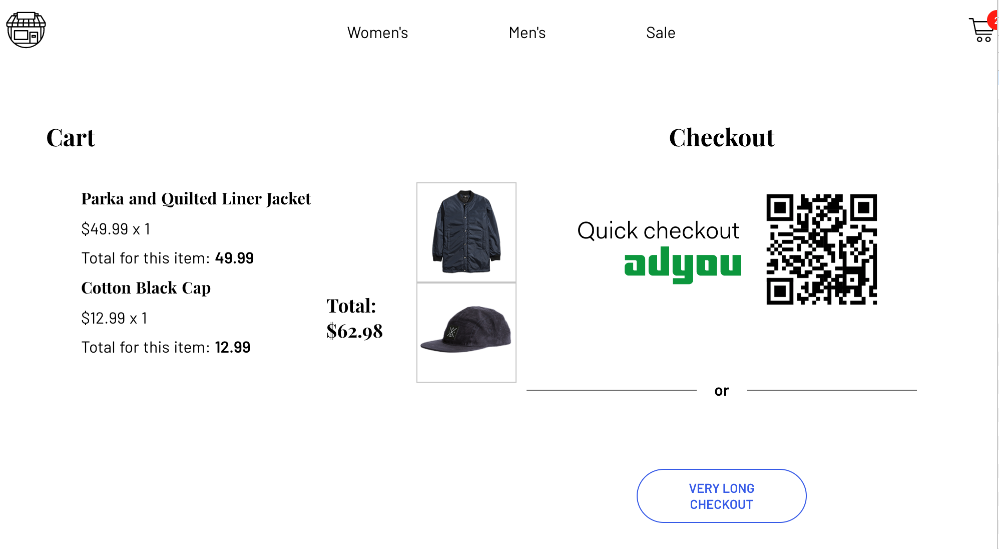
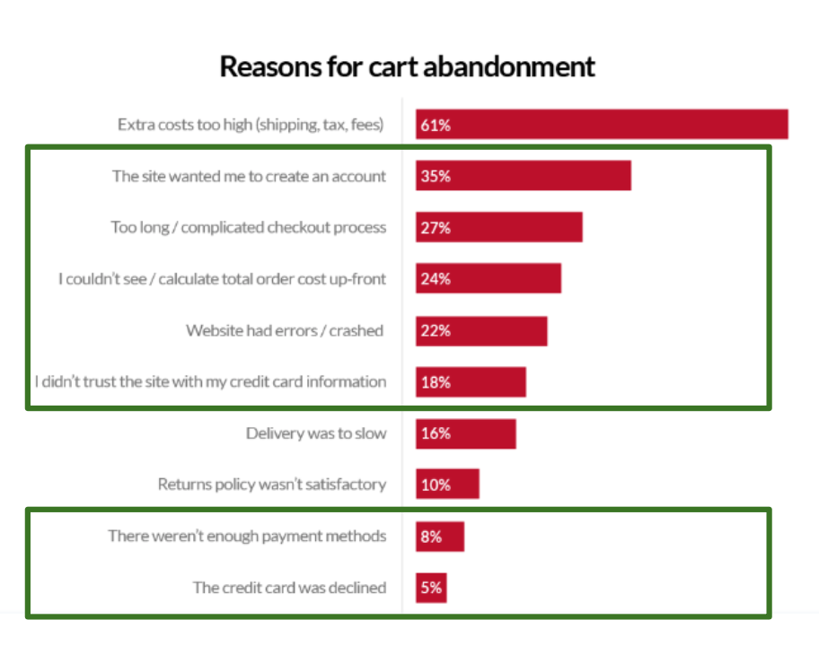

# Adyen Checkathon - Amsterdam January 2019 - Team Five

## The challenge

In a team with diverse skills and backgrounds, you are going to build a functional website for a company of your choosing, using our Checkout API. Your team should address the problems this company faces when having shoppers pay through their website, including issues such as handling risky/fraudulent transactions, redirecting to local payment methods, saving sensitive shopper information, and so on.

The exact issues you focus on and what you build is up to you and your team, but you need to consider a range of criteria including:

- Visual appeal and ease of use

- The payment experience of the shopper

- Security and risk/fraud mitigation

- To what extent you leverage the capabilities of the API

## The solution (code name 'Adyou')

### Implement a one-click checkout based on an external mobile app and a QR code displayed on the shopping page. The mobile app would be owned by Adyen with whom the shopper would have an account to maintain its payment/shipping information. The QR code would be connected to such account and would be available for merchants connected to Adyen.

- Scanning the QR code (for the demo we will click on it) will automatically lead to a simple confirmation page with the pre-filled shipping and payment data where the user can complete the payment.
- Clicking the button `very long checkout` will take you through a customized set of screen implementing both Adyen's test credit cards and iDeal payment flows. Credit card data will be secured.

### Business case

#### For the Merchant

- On the merchant side there is an average of 73% cart abandonment rate.
- A seamless checkout experience could lead to 4 times more revenue.
- 'Hosting' customer's payment and shipping information would lead to less IT development and maintenance time and costs
 
#### For the Shopper

- Maintaining of payment and shipping information in just ONE place instead of at each webshop. This would lead to a seamless purchase experience.
- Even when buying from a foreign website, the buyer would avoid poorly translated payment/shipment forms.

#### For Adyen

- Revenue opportunity on the consumer market
- Additional service offering towards the merchants

### Technical overview

#### Front-end ([this repo](https://github.com/sdurighello/team5-adyen-vue))

- VueJS scaffolding with NuxtJS, For detailed explanation on how things work, checkout [Nuxt.js docs](https://nuxtjs.org).
- Code for the Product catalog and Cart boilerplate was re-used from [srdra's sample vue shop](https://github.com/sdras/sample-vue-shop)
- Checkout and payment process created new as per hackathon requirements
- Credit card details encrypted using [Adyen's SecureFields library](https://docs.adyen.com/developers/checkout/api-integration/collecting-raw-card-data)
- Build setup:
    - install dependencies: `yarn install`
    - serve with hot reload at localhost:3000 `yarn run dev`

#### Back-end

- Serverless API functions on Microsoft Azure [in this repo](https://github.com/sdurighello/team5-adyen-azure) to all Adyen Checkout APIs 

#### Mobile app (Adyou)

- Sketched but not technically implemented. For the demo it will be assumed to be installed and fully functional (including integration on Adyen's servers)
